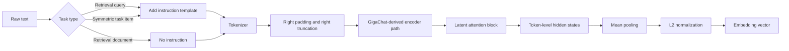

# Investigation of Giga-Embeddings-instruct and the Closed-Source Wrapper Question

## Executive summary

The strongest conclusion supported by the public record is **not** that a closed-source wrapper has been proven to exist, but rather that **the exact ruMTEB evaluation recipe is not fully published**. The Hugging Face repository for `ai-sage/Giga-Embeddings-instruct` contains open custom model code, SentenceTransformers metadata, tokenizer files, and weights under an MIT license; I did **not** find an official server, Docker image, inference endpoint, or wrapper script in the public model tree, and the model page says it is not deployed by any Hugging Face Inference Provider. citeturn48view3turn48view0turn48view1turn48view2turn35view0

At the same time, the public artifacts make it clear that **external prompt orchestration matters for top benchmark results**. The paper reports that instruction prompting outperformed prefix prompting on ruMTEB, the model card documents a manual `Instruct: ...\nQuery: ...` template, and the FAQ says performance drops if instructions are omitted. Yet the released SentenceTransformers config does **not** bake in any non-empty default prompt mapping, so the benchmark-time task instructions were almost certainly supplied by external evaluation code rather than by a hidden behavior inside the model files themselves. citeturn43view0turn35view0turn51view0

There is one especially important clue: an older README example used `AutoModel.from_pretrained(...).encode(..., instruction=...)`, but the public `modeling_gigarembed.py` does not expose an `encode` method on the raw Hugging Face `AutoModel` class. Later commits removed that example and replaced it with open, standard Hugging Face / SentenceTransformers usage. That discrepancy is consistent with **either** an undocumented internal helper/wrapper used by the authors **or** a documentation mistake. Public evidence does **not** let me distinguish those two possibilities with high confidence. citeturn40view0turn34view2turn49view5turn35view0

My bottom-line assessment is therefore:

**Closed-source wrapper proven?** No.  
**External wrapper or helper likely used to supply prompts and evaluation-time settings?** Yes, very likely.  
**Was that helper necessarily closed-source?** Public evidence is insufficient to say yes.  
**Is the public repository alone enough to reconstruct the exact ruMTEB recipe that yielded the advertised ranking?** Not completely. Several key settings remain unspecified. citeturn35view0turn43view0turn16view0turn21view0

## Scope and method

This investigation prioritized primary and near-primary sources: the Hugging Face model page and repository files for `ai-sage/Giga-Embeddings-instruct`, its commit history and discussions, the official ruMTEB benchmark paper, the later GigaEmbeddings paper, Hugging Face leaderboard artifacts, and public community usage examples attached to the model page. citeturn35view0turn48view3turn14view0turn44view0turn27view0turn39view0

I also checked for evidence of official hosted inference paths and wrapper infrastructure. The Hugging Face model page explicitly says the model is **not** deployed by any Inference Provider, while the public model tree exposes the model/config/tokenizer/SentenceTransformers files but no official service implementation. Community wrappers do exist, but the ones I found were posted openly in Hugging Face discussions or as public derivative artifacts such as an ONNX conversion, not as proprietary official infrastructure. citeturn35view0turn48view3turn17view0turn45search1

A critical methodological caveat is that the model repository changed after the benchmark claims tied to December 2024. The config history shows an initial upload on December 12, 2024, later model/config updates in May 2025 and September 2025, and a tokenizer-loading fix merged in October 2025. That means the current `main` branch is not guaranteed to be bit-for-bit identical to the artifact used for the earliest ruMTEB claims. citeturn21view0turn25view0turn48view3

## Public artifacts on Hugging Face

The public Hugging Face repository exposes the core implementation openly. The model tree lists `config.json`, `configuration_gigarembed.py`, `modeling_gigarembed.py`, `modules.json`, `config_sentence_transformers.json`, tokenizer files, the SentenceTransformers pooling config, and the weight shards. The page also tags the model as `custom_code`, which here refers to code that is **published in the repo**, not a hidden binary or private API. citeturn48view3turn35view0

The repo structure is important because it argues against a hidden wrapper being embedded in the released package. Searches across the public tree did not turn up an official `Dockerfile`, `app.py`, or server/wrapper entrypoint. What is present is a standard SentenceTransformers module chain: `Transformer` → `Pooling` → `Normalize`, declared in `modules.json`. citeturn48view0turn48view1turn48view2turn50view0

The released config and code also show that the actual model implementation is open. `config.json` maps `AutoConfig` and `AutoModel` to public custom files, declares the `GigarEmbedModel` architecture, sets `max_position_embeddings` to `4096`, and includes a field `is_mask_instruction: true`. The public model code then defines `forward`, latent attention, and mean pooling with L2 normalization. citeturn23view0turn49view5

That said, the public files contain several inconsistencies and omissions that matter for reproducibility:

| Source | Type | Date | What it shows | Relevance | Confidence |
|---|---|---:|---|---|---|
| `config.json` citeturn23view0 | Official repo file | current `main` | Open custom model architecture; `is_mask_instruction: true`; `max_position_embeddings: 4096` | Strong evidence that the core model is open, not hidden | High |
| `modeling_gigarembed.py` citeturn49view5 | Official repo file | current `main` | Public `forward`, encoder mask update, latent attention, mean pooling, L2 normalization | Strong evidence for the released inference path | High |
| `modules.json` citeturn50view0 | Official repo file | current `main` | SentenceTransformers wrapper is standard and open | Strong evidence against a hidden official wrapper in-repo | High |
| `1_Pooling/config.json` citeturn22view0 | Official repo file | current `main` | `include_prompt: true` | Important for prompt-token pooling behavior | High |
| `config_sentence_transformers.json` citeturn51view0 | Official repo file | current `main` | `prompts.query=""`, `prompts.document=""`, `default_prompt_name=null` | Shows benchmark prompts are **not** baked into the released ST config | High |
| `tokenizer_config.json` citeturn24view0 | Official repo file | current `main` | Right padding/right truncation; `pad_token: <unk>`; weird huge `model_max_length` sentinel | Shows tokenizer/runtime ambiguity | High |
| Config commit history citeturn21view0 | Official repo history | 2024–2025 | Initial upload Dec 12, 2024; later updates May/Sep/Oct 2025 | Current repo may differ from benchmark-time artifact | High |
| PR `fix_name_or_path` citeturn25view0 | Official repo PR | Oct 2025 | Tokenizer-loading behavior changed after release | Reproduction from current repo may differ from older runs | High |
| Older README blame snapshot citeturn40view0 | Official repo history | older version | Documents `AutoModel.encode(..., instruction=...)` | Strong clue of undocumented helper or documentation error | Medium-High |
| README rewrite commit citeturn33view0turn34view2 | Official repo history | Sep 23, 2025 | Removes the older `AutoModel.encode(..., instruction=...)` example | Confirms the public usage story changed | High |

Two findings stand out.

First, the current SentenceTransformers config does **not** include any task prompt defaults. It explicitly sets empty `query`/`document` prompts and `default_prompt_name: null`. That means the released artifact does not itself encode the task-specific ruMTEB prompt mapping. Anyone reproducing the reported scores must supply those prompts from somewhere else. citeturn51view0

Second, there is a mismatch between config intent and implementation. `config.json` includes `is_mask_instruction: true`, but I found no corresponding `is_mask_instruction`, `mask_instruction`, or `instruction_mask` logic in the released `modeling_gigarembed.py`. At the same time, the SentenceTransformers pooling config sets `include_prompt: true`, meaning prompt tokens are included in pooling unless an external mechanism masks them. Publicly released model code therefore does **not** show an automatic model-side “mask off the instruction” behavior. citeturn23view0turn22view0turn49view0turn49view1turn49view2turn49view5

That combination strongly suggests that, if special prompt handling was important for ruMTEB, it lived in **evaluation-time code outside the weight files**. What remains unknown is whether that code was open but simply unpublished in the model repo, or genuinely private. citeturn35view0turn43view0

## ruMTEB evidence and benchmark settings

The later GigaEmbeddings paper is explicit on the top-line claim: the model achieved **69.1 average on 23 ruMTEB tasks** and, according to the paper, held the top position on ruMTEB “as of December 2024.” The same paper reports that instruction prompting beat prefix prompting, **69.3 vs 68.5**, and that the pruned model variant preserved nearly all quality, **69.1 vs 69.3**. citeturn43view0turn28view4turn28view5turn29view1

That matters for the wrapper question because the paper itself says the prompt strategy changes quality. In other words, the ruMTEB results were not just “weights in, embeddings out”; they depended on how the tasks were phrased to the model. The paper, however, does **not** publish a task-by-task prompt catalog, evaluation script, or prompt-routing code. It tells us that instruction prompting was better, but not exactly which instruction text was used for each ruMTEB task category. citeturn43view0

The current model card fills in some of that gap, but only partially. It documents a generic template:

```text
Instruct: {task_description}
Query: {query}
```

and says that retrieval documents do **not** need instructions, while symmetric tasks such as classification and STS should add instructions on every input/query. The FAQ further states that the model was trained this way and that omitting instructions degrades quality. These are powerful clues about how ruMTEB was likely run, but they are still not a published benchmark script. citeturn35view0

A snapshot of the legacy Hugging Face leaderboard shows `Giga-Embeddings-instruct` in the Russian benchmark artifacts, but those public JSONL rows expose scores and some metadata fields, not the prompt settings, tokenizer overrides, or wrapper code used for the run. In one legacy slice I examined, several metadata fields for the model were blank, underscoring that the leaderboard artifact itself is not a full provenance record. citeturn39view0

Another benchmark-related clue comes from the Hugging Face discussion titled “MMTEB Submission.” On February 1, 2025, a member of the MTEB team asked the authors to submit their model to the new multilingual leaderboard system. That suggests the benchmark ecosystem around this model was still transitioning, and it makes the absence of a fully published model-specific submission manifest more understandable. It does **not** prove any proprietary wrapper, but it does confirm that public benchmark metadata was incomplete at that stage. citeturn16view0

## Reconstructed inference pipeline

The public artifacts are sufficient to reconstruct a **likely** open inference path for ruMTEB-style usage, even though they do not fully specify the historical benchmark run. The model card, tokenizer config, `config.json`, SentenceTransformers config, and model code together support the following pipeline. citeturn35view0turn24view0turn23view0turn51view0turn49view4turn49view5



The prompting side is reasonably clear. The current model card shows a raw Transformers route that builds queries with a helper returning `Instruct: ...\nQuery: ...`, then tokenizes the concatenated query/document list, calls `model(..., return_embeddings=True)`, and scores cosine similarity. The SentenceTransformers example instead passes the same instruction string via the `prompt=` parameter to `model.encode(...)`. Both are public, open paths. citeturn35view0

The tokenization side is less clean. Public tokenizer config says padding is on the **right**, truncation is on the **right**, BOS is `<s>`, EOS is `</s>`, and `pad_token` is `<unk>`. Meanwhile the model code’s `add_pad_token()` overrides `pad_token_id` to `0` and enforces the configured padding side. The examples and `text_config` both point to `4096` as the working sequence limit, but `tokenizer_config.json` still carries a legacy-looking `max_length: 512` alongside an effectively infinite `model_max_length` sentinel. That is a real public inconsistency and a plausible source of reproduction drift. citeturn24view0turn23view0turn49view5turn35view0

The forward path itself is open. The model updates an encoder-style mask so tokens can attend bidirectionally, applies the underlying GigaChat-derived model, feeds the last hidden states through the latent attention block, and then mean-pools with L2 normalization when `return_embeddings=True`. If the model is loaded through SentenceTransformers instead, `modules.json` and the pooling config show that the public ST wrapper mean-pools and normalizes token embeddings in an ordinary open-source way. citeturn49view4turn49view5turn50view0turn22view0

A subtle but important implication follows. Because `config_sentence_transformers.json` has empty prompts and `default_prompt_name: null`, and because I found no model-side instruction-masking logic, the best-results ruMTEB recipe likely required **external code to decide which instruction to prepend for each task**. That is external orchestration, but the public evidence does not show it as an official proprietary wrapper. citeturn51view0turn49view0turn49view1turn49view2turn35view0turn43view0

A few source-derived command snippets are especially revealing:

The model card’s public template for query construction is the short string below. citeturn35view0

```text
Instruct: {task_description}
Query: {query}
```

A community GGUF conversion attempt used the command below and failed on a latent-attention tensor name, confirming that the architecture is non-standard enough to require custom handling in some runtimes. citeturn17view0

```bash
python3 ~/Sources/llama.cpp/convert_hf_to_gguf.py ./Giga-Embeddings-instruct --outtype bf16
```

A community OpenAI-compatible wrapper posted in the model discussions loads the model through SentenceTransformers and serves `/v1/embeddings`, which is an **open** wrapper example rather than a proprietary one. citeturn17view0

## Assessment of the closed-source wrapper hypothesis

The evidence is best understood by separating three different hypotheses.

| Hypothesis | Supporting evidence | Counterevidence | Judgment |
|---|---|---|---|
| An official closed-source inference service or wrapper produced the public ruMTEB results | Older README once referenced a raw `AutoModel.encode(..., instruction=...)` API that does not exist in current public code, which is consistent with some missing helper layer. citeturn40view0turn49view5 | No official server/wrapper files in the repo tree; no HF Inference Provider deployment; no official wrapper repo surfaced in the public artifacts I reviewed. citeturn48view3turn48view0turn48view1turn48view2turn35view0 | **Not verified.** Public evidence is insufficient. |
| Some external helper code was used to generate ruMTEB prompts and settings | Paper shows instruction prompting materially improved ruMTEB score; current ST config does not store prompts; FAQ says instructions are required for best quality. citeturn43view0turn51view0turn35view0 | External code could have been a simple public local script; nothing proves it was proprietary. | **Very plausible.** |
| The released open artifacts are enough to implement the inference path without any closed wrapper | Current model card documents both raw Transformers and SentenceTransformers usage; community users built open wrappers around the model; ONNX/public derivatives exist. citeturn35view0turn17view0turn45search1 | Exact historical prompt mapping, task instructions, and benchmark-time repo version are not fully specified. citeturn21view0turn43view0turn16view0 | **Supported for generic use, not fully sufficient for historical ruMTEB reproduction.** |

The single most suspicious artifact remains the old README example. In that snapshot, the docs said to load the model with `AutoModel.from_pretrained(...)` and then call `model.encode(..., instruction=...)`. The released `GigarEmbedModel` class does not publish such an `encode` method; later commits removed the example and replaced it with standard open usage patterns. The cleanest interpretation is that the older documentation either referenced an unreleased local helper or was simply incorrect. Both are plausible; neither proves a closed-source benchmark wrapper. citeturn40view0turn33view0turn34view2turn49view5turn35view0

The broader benchmark evidence points in the same direction. The paper clearly says prompt strategy affects score, and the model card says instructions matter, but the released package does not carry a built-in prompt registry. So the highest-confidence statement is this: **the reported ruMTEB results almost certainly depended on external evaluation logic for prompts and task handling, but I found no direct public proof that this external logic was an official closed-source wrapper rather than an unpublished but straightforward local script.** citeturn43view0turn35view0turn51view0

## Legal and ethical considerations

The model is publicly released under an MIT license, and its custom architecture code is exposed in the Hugging Face repository. That supports legitimate public-source analysis of the released artifacts. It does **not** justify accessing private systems, bypassing access controls, or misrepresenting inference about undocumented internals as established fact. citeturn14view0turn48view3

If a closed benchmark wrapper did exist internally, reverse-engineering it beyond public artifacts would raise practical and ethical issues around unpublished implementation details, evaluation provenance, and fair attribution. The safest and most rigorous approach is to distinguish carefully between what is directly evidenced in public code and what is only inferred from documentation gaps or benchmark deltas. In this case, that distinction matters: the public evidence supports **missing provenance**, not a proven secret wrapper. citeturn35view0turn43view0turn21view0

## Open questions and recommended next steps

Several key points remain unspecified in the public record.

- **Which exact prompt strings were used for each ruMTEB task category?** The paper establishes that instruction prompting helped, and the model card gives generic templates, but I did not find a public task-by-task mapping. citeturn43view0turn35view0
- **What produced the older `AutoModel.encode(..., instruction=...)` example?** It may have been an internal helper, or it may have been a documentation error. The public repo does not resolve that ambiguity. citeturn40view0turn49view5
- **Was instruction masking ever part of the intended evaluation path?** `config.json` contains `is_mask_instruction: true`, but the released model code does not show corresponding logic, while SentenceTransformers pooling is configured with `include_prompt: true`. citeturn23view0turn22view0turn49view0turn49view1turn49view2turn49view5
- **Which exact repo state corresponds to the December 2024 ruMTEB claim?** The model repository changed later, including weight/config updates and tokenizer-loading fixes. citeturn21view0turn25view0
- **Did ruMTEB use raw Transformers or SentenceTransformers for the advertised run?** Both open paths are documented publicly, but I did not find a public benchmark script for this model that settles the question. citeturn35view0turn16view0

The most productive next investigative steps are straightforward.

Ask the authors to publish the exact ruMTEB evaluation script or MTEB submission manifest used for the headline results, including the prompt text per task family, sequence length, library versions, and whether the run used raw Transformers or SentenceTransformers. Ask specifically whether the now-removed `AutoModel.encode(..., instruction=...)` example reflected unreleased internal helper code. Finally, request a pinned historical tag or commit corresponding to the December 2024 benchmarked artifact, because the present `main` branch is demonstrably newer than the original claim window. citeturn21view0turn25view0turn33view0turn35view0turn43view0

Overall, the public evidence supports a nuanced answer: **no verified closed-source wrapper was found, but the public materials do not fully specify the prompting and orchestration layer that likely mattered for the reported ruMTEB results.**